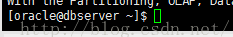
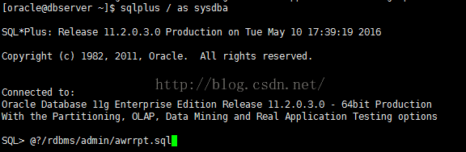
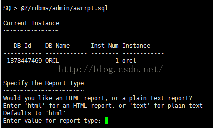
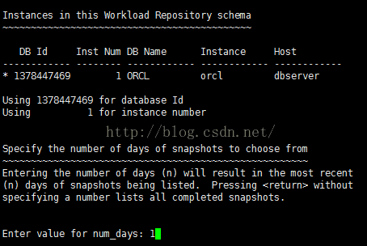
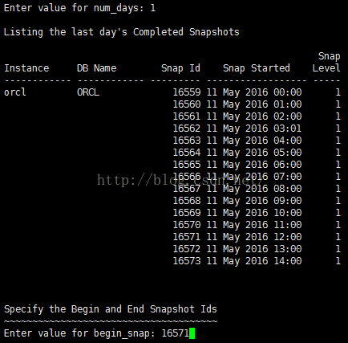
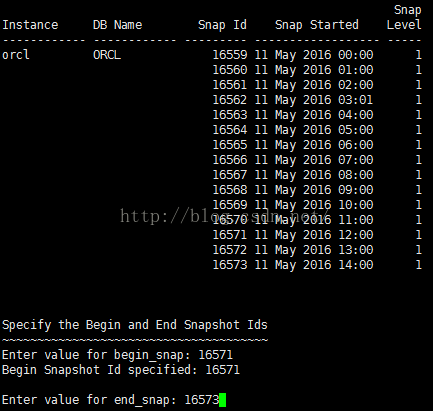
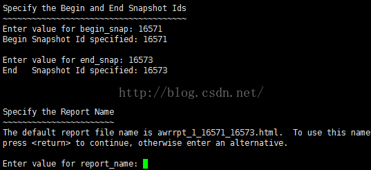
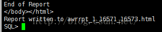
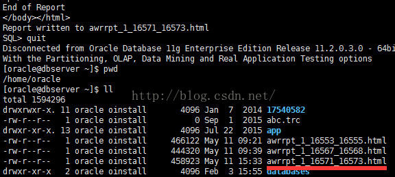

## oralce_AWR性能分析生成报告流程
- 准备工作
    - 报告脚本sql脚本位置检查
        - @$ORACLE_HOME/rdbms/admin/awrrpt.sql
        - @$ORACLE_HOME/rdbms/admin/awrrpti.sql
        - 单机sql脚本位置（/u01/app/oracle/product/11.2.0/dbhome_1/rdbms/admin）
        - RAC SQL脚本位置（/u01/app/oracle/product/11.2.0/db_1/rdbms/admin）
- 1：用ssh或者xshell登录到数据库虚拟机或者实体机,切换到oracle账户，输入echo $ORACLE_HOME查看环境变量位置
    - 

- 2:进入SQLPLUS
    - 
- 3:执行脚本(@?/rdbms/admin/awrrpt.sql)
    - 
- 4:设定生成报告的格式.说明：不用输入，默认即可，直接按Enter
    - 
- 5：设定报告时间段的天数.说明：只导当天的时间点则输入1；导昨天的时间点则输入2；前天则3，默认最大7天。
    - 
- 6：设定报告开始时间点.说明：例如下图所示16571代表的是2016年5月11日12时。
    - 
- 7：设定报告结束时间点.说明：例如下图所示16573代表的是2016年5月11日14时。
    - 
- 8：设定报告名称.说明：不用输入，默认即可，直接按Enter
    - 
- 9：AWR报告生成正常结束
    - 
- 10：获取报告.说明：通过FTP软件，从当前路径中获取AWR报告。
    - 
- 参考资料
    - [具体生成报告操作流程连接地址](http://blog.csdn.net/bbliutao/article/details/51375693)
    - [具体视图信息SQL语句查看](oracle_awr_workload_repository_views.sql)
    - [Oracle AWR简介](http://www.linuxidc.com/Linux/2011-10/44563.htm)
    - [星球上最详细的AWR解析报告](http://blog.csdn.net/songyang_oracle/article/details/6558503)
    - [Automatic Workload Repository (AWR) in Oracle Database 10g](https://oracle-base.com/articles/10g/automatic-workload-repository-10g)
- 生成效果
  - [报表生成效果图-建议在浏览器浏览](./awrrpt_1_5382_5535.html)